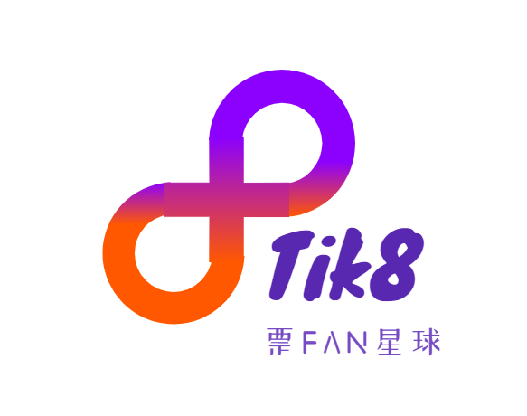

# TIK8

***

## Brief Intro of demo

### Docs："/docs"
#### PPT : "/docs/TIK8.pdf"

### FLOW Configuration file："/flow"

### Demo main Files："/src"
#### Cadence Files："/src/cadence"
This dictionary stores all the cadence files needed, in 3 particular types：1) Contracts 2) Transactions 3) Scripts

- **Contracts**："/src/cadence/contract"
  - NebulaActivity.cdc：The core contracts, defines various resources, interfaces and structs
 
- **Transactions**："/src/cadence/transactions"
  - add_tickets_info.cdc: Add the tickets' information of one activity
  - create_activity.cdc: Transaction to create your own activity
  - purchase_ticket.cdc: Transaction to purchase the particular ticket
  - set_up_account.cdc: Transaction to initialize the account's ticket collection and activity manager
  - verify_ticket.cdc: Transaction to verify tickets on chain and safety is secured
- **Scripts**: "/src/cadence/scripts"\
Scripts to query all sorts of data in NebulaActivity contract. Because the contract itself has been written in the corresponding comments, 
so in the given example only part of the function is quoted, the specific can be quoted function details see: NebulaActivity.cdc

#### The Web UI and Frontend code："/src/ui"
- **html**："/src/ui/html"\
UI coded in html+css+js

- **Transactions**："/src/cadence/transactions"\
UI coded using NEXT.js

***

## Project Description

Tik8 uses activity participation to create "interest persona" social medium, providing a platform for users to build and participate in activities, allowing them to become activity co-creators. We encourage users to participate in activities, get NFT and create their digital persona to socialize. By binding NFTs to physical rights, users can access services in offline activities as well, realizing the linkage between online and offline. The project has designed a Social To Earn system that allows players to earn incentives for socializing, and these incentives in turn promote users to socialize! Also, thanks to the cooperation with many famous events, points can unlock more hidden benefits and community features!\
The main gameplay of the project can be divided into three steps:\
（1）Interest to Social: Make friends through interest activities. \
（2）Social to Earn: Earn incentives for social participation.\
（3）Collect to KOL/KOC: Accumulate participation footprints to become a master!

### Project Background (problems to be solved)

- Target audience\
  Generation Z and new urban white-collar workers (post-90s-00s group).

- Evidence for the need
    - **Activity consumption is still the immediate need in the post-epidemic era, adjust the structure to unlock the consumption potential.**\
      Online activities such as performances and scripted killings need online vouchers (tickets) to be realized. Meanwhile, offline entertainment activities have steadily recovered, and in 2022Q1, 
  the global performance market box office revenue was USD 1.09 billion, recovering to 47% of the same period in 2019.
    - **Web3 social is a blue ocean, still to be unlocked**\
      Web3 is still exploring social products and social methods for web3 people. Web3 natives are generally looking forward to "authenticity" social and new social methods. 
    Tik8 is building DIDs through NFT and developing social relationships based on them, 
      using the Social to Earn system to achieve "Incentivized social". 
    - **The unique needs of Generation Z**\
      Generation Z generally respects self-pleasure, pursues quality to price ratio, and prefers to pay for experience. They often spend money to build their own persona and spend a lot on social and interest activities.

### Product Solution

- Product Description
  Tik8 is a ticketing NFT social Dapp that digitizes tickets through NFT technology to generate consumable, collectable and write-off functions. Users purchase and collect ticket stubs while creating their own KOL persona, generating new value in the web3 world.
- Program Architecture
    - Cadence Contracts
        - Contracts
        - Transactions
        - Scripts
<<<<<<< HEAD
    - UI & Web Frontend
- Logo\
  
- Operating Strategies
    * **Kernel Optimization**\
  Users enter the limited-time community with consumption (NFT), and with high interactivity to meet multiple social needs, improve social efficiency and experience, and release the missing social value of traditional ticketing. After entering the long-term community, the growth system and incentive system will increase the repurchase rate and activity.
    * **Users as Channels**\
      Leveraging the expansion of the user's personal network, through the closed loop of marketing from online (ticket purchase, socialization, ticket root collection display) to offline (event experience)
=======
    - 前端UI
- 产品Logo\
  
- 运营策略
    * **内核优化**\
  用户凭消费（数字藏品）进入限时性社群, 配合高互动性满足多元社交需求，提高社交效率和体验感, 释放传统票务缺失的社交价值。进入长期社群后, 通过成长体系和激励制度提高复购率和活跃度
    * **用户即渠道**\
        利用用户个人关系网扩张, 贯穿从线上（购票、社交、票根收藏展示）到线下（活动体验）的营销闭环
>>>>>>> 0dec330a89db5f58ea9c7049c49d5e9063ba57e3
