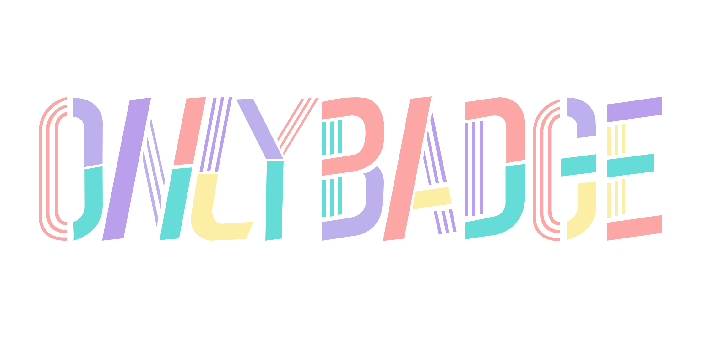
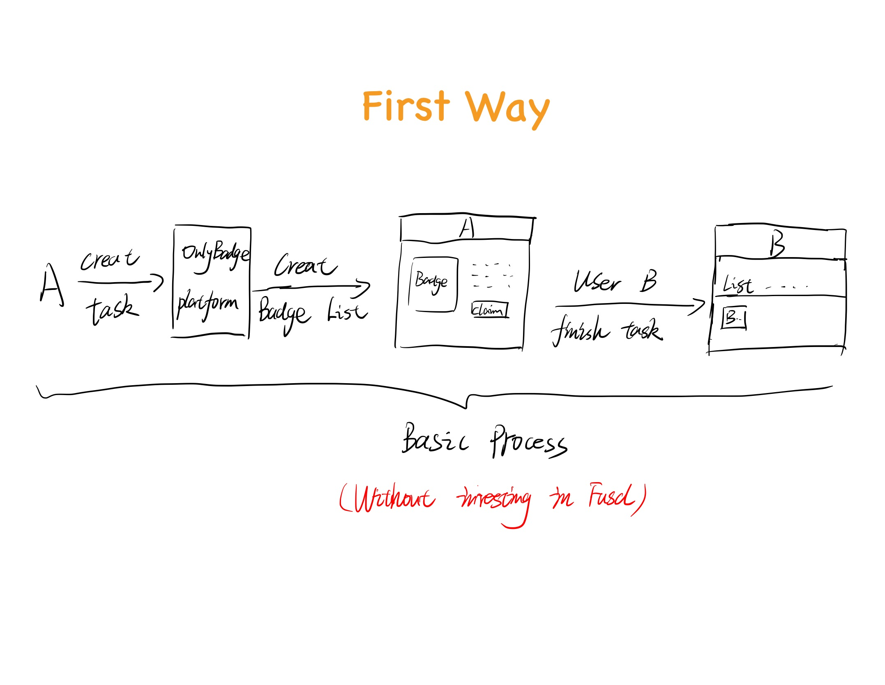
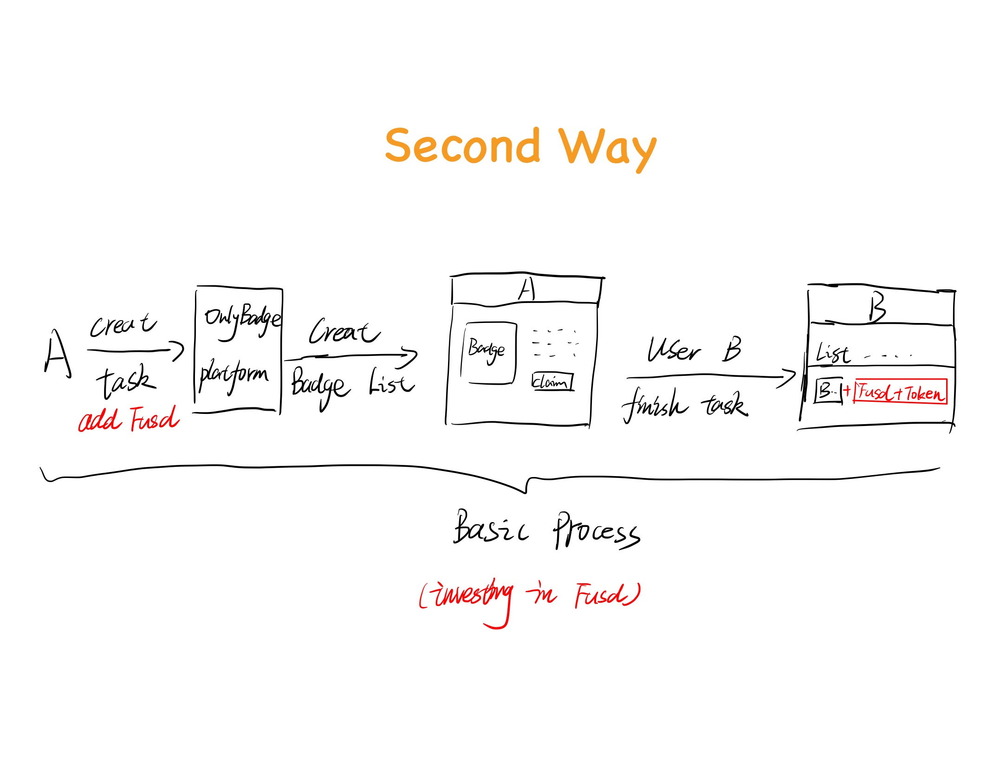

    

## Track

- [ ] NFT x DAO/Tools
- [ ] NFT x Game/Entertainment
- [x] NFT x Life/Metaverse

## Introduction

### 1. Project introduction

OnlyBadge wants to help more real-world enterprises better enter the blockchain world through the features of NFT, as a bridge between the two, so that real-world enterprises can have more chances in the blockchain world. The inspiration for creating this project mainly comes from the current web3 products: Project Galaxy, POAP and some current traditional social media platforms.

### 2. The landing application scenario of the project (improving the problem of centralization of traffic exposure)
For example, traditional companies need to pay high fees in order to gain exposure to the platform, and ultimately they may not be able to achieve the expected goals of the company. At the same time, when companies want to promote their products or services through activities, they also need to spend a certain amount of money to find influential Internet celebrities to promote them. OnlyBadge wants to change the traffic exposure mode of the current centralized platform through the form of NFT.

### 3. The process of the project to solve the problem of centralization of traffic exposure
NFTs in the blockchain can improve the current situation where the platform traffic distribution is too centralized. Customers can obtain badges released by the enterprise after completing the tasks released by the enterprise.Enterprise can also airdrop badges to their targeted customers through analyzing on-chain activities in order to gain more attractions and promote their services or products.

---
The basic process is as follows:

The first way (without investing in Fusd): A company can choose to only create a badge to motivate B users to participate in the activity. At this time, the badge obtained by the user after completing the task of the enterprise is liquid and can be used as a certificate for participating in the enterprise airdrop in the future.

#### (1) A creates and distributes Badge for the first time to obtain the traffic exposure time of the platform.
#### (2) With the passage of time, the exposure weight gradually decreases. At this time, new badges and tasks can be created to refresh the exposure time. However, the traffic exposure time obtained for the second time will be greatly reduced compared to the first time, and the third refresh time Significantly reduced on the basis of the second.
#### (3) In addition, Bribe can also be added to the traffic pool to gain voting weight and exposure time.
#### (4) The user obtains tokens that do not contain Fusd and OnlyBadge platforms in the badge.

    

---
The second way (investing in Fusd): When enterprise A creates badges and tasks, it can also invest in Fusd to encourage users B to participate in activities. After users complete the tasks of the enterprise, they can get the badges corresponding to the activities and the Fusd invested by the enterprise. A trading pair consisting of the token of the OnlyBadge platform.
#### (1) A that invests in Fusd will get a higher exposure duration and weight than A that does not invest in Fusd. At the same time, the subsequent creation of badge tasks can refresh the exposure duration, and the duration will not be greatly reduced immediately, but will go with a more gentle curve. gradually decreases.
#### (2) The Fusd invested by A will be converted into a trading pair composed of the tokens of the Fusd+OnlyBadge platform, and distributed to the badge created by A.
#### (3. The trading pair formed by the token combination of Fusd+OnlyBadge platform will gain voting rights and participate in the distribution of platform traffic.
#### (4) The user gets the token containing Fusd and OnlyBadge platform in the badge.
#### (5) The Fusd and OnlyBadge tokens obtained by users have a lock-up period, and the voting rights belong to A during the lock-up period.
#### (6) The transaction pair composed of Fusd and the token of the OnlyBadge platform obtained by the user will be released linearly over time, as will the voting rights. After the release is complete, the user can vote for the user’s favorite company according to the user’s wishes.

    

## What was done during Web3 Jam

<!-- Please list the features and docs you achieved during the event -->

> Delivery Meterials

- [Source Code](./src/), deployed to Testnet address: 0xfee52c2891929ed3
<!-- Optional -->
- [Pitch Deck](./docs/deck.pdf) <!-- or using online documentation url / ipfs url -->
- [Demo Video](./docs/demo.mp4) <!-- or using online documentation url / ipfs url -->
- [Testnet Demo] [https://testnet.onlybadge.life](https://testnet.onlybadge.life) 

## Additional information

#### Code forked from [KittyItems](https://github.com/onflow/kitty-items) and made lots of changes.  ❤️ with Kitties!